:source-highlighter: prettify
:toc: left
:toc-title: Sumário

= Atividades Processamento Digital de Imagens
:author: Ítalo Hugo Costa Bezerra 
:email: italocosta16@gmail.com

Departamento de Engenharia de Computação e Automação.

== 1ª Unidade

=== Exercício 1 - regions.cpp

[sidebar]
****
[source,c++]
----
include::regions.cpp[]
----
****

Os resultados são mostrados abaixo para os pontos (30,30) e (135,135):

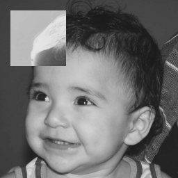

=== Exercício 2 - trocaregioes.cpp

[sidebar]
****
[source,c++]
----
include::trocaregioes.cpp[]
----
****

Os resultados são mostrados abaixo:

image:result.png[biel]

=== Exercício 3 - Preenchendo regiões

[sidebar]
****
[source,c++]
----
include::contagem.cpp[]
----
****

Figura base:

image:bolhas.png[]

Os resultados são mostrados abaixo:

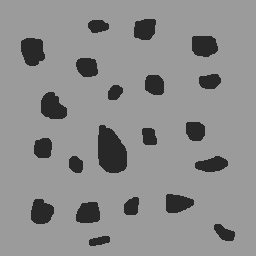

=== Exercício 4 - equalize.cpp

[sidebar]
****
[source,c++]
----
include::equalize.cpp[]
----
****

Figura base:

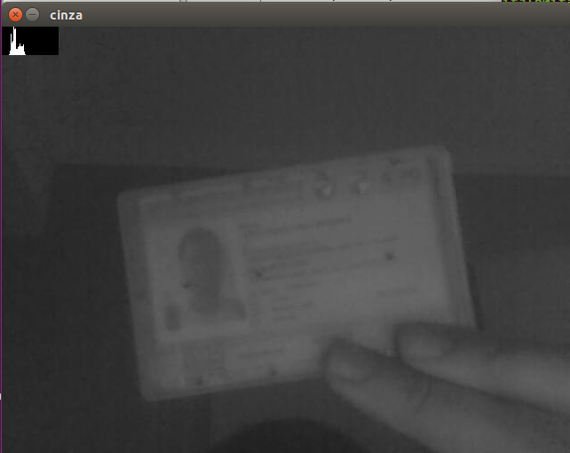

Os resultados são mostrados abaixo:

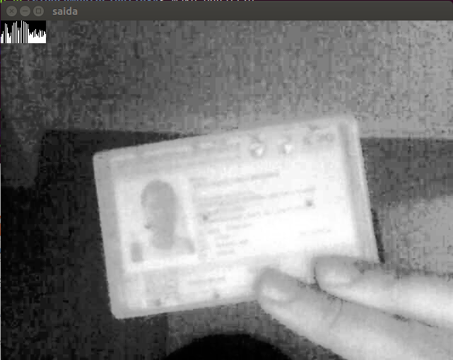

=== Exercício 5 - motiondetector.cpp

[sidebar]
****
[source,c++]
----
include::motiondetector.cpp[]
----
****

Os resultados são mostrados abaixo:

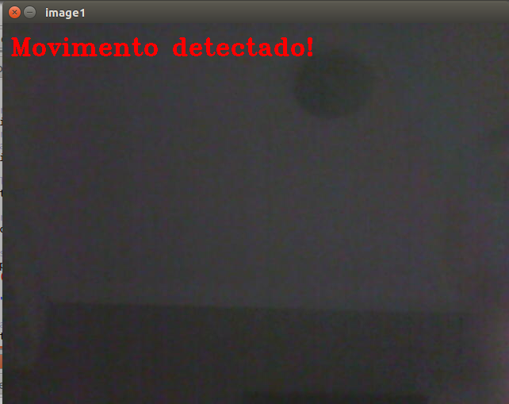

=== Exercício 6 - laplgauss.cpp

[sidebar]
****
[source,c++]
----
include::laplgauss.cpp[]
----
****

Figura base:

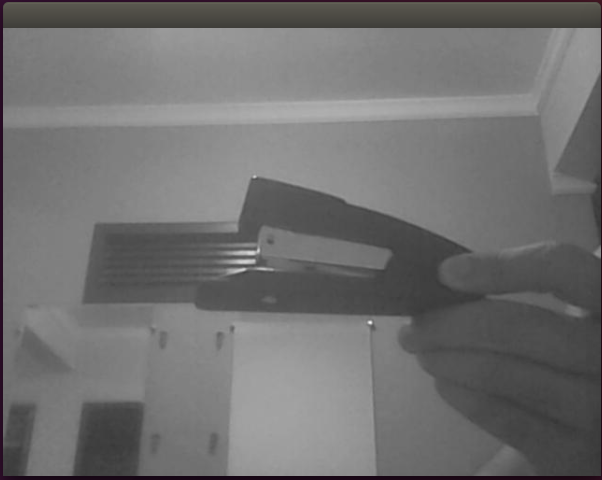

Os resultados são mostrados abaixo:

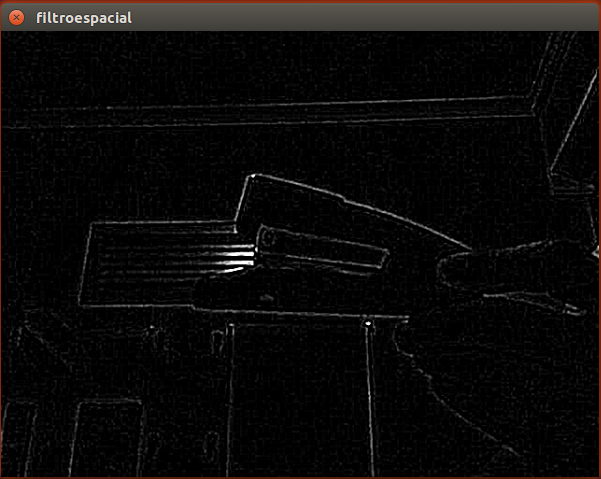

=== Exercício 7 - tiltshift.cpp

[sidebar]
****
[source,c++]
----
include::tiltshift.cpp[]
----
****

Figura base:

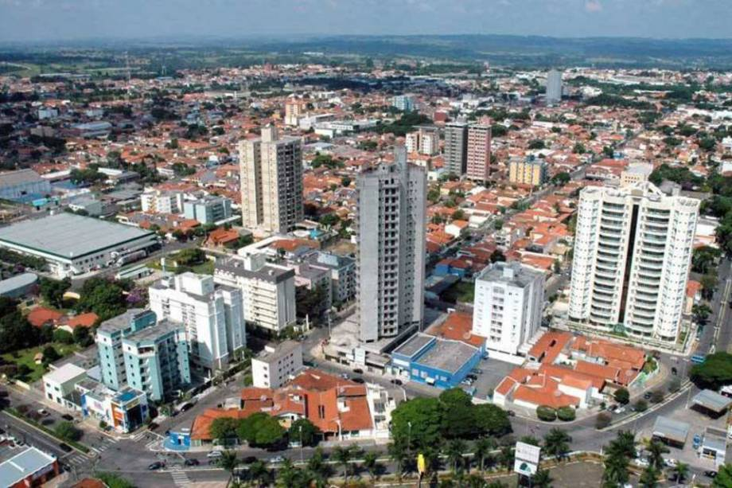

Os resultados são mostrados abaixo:

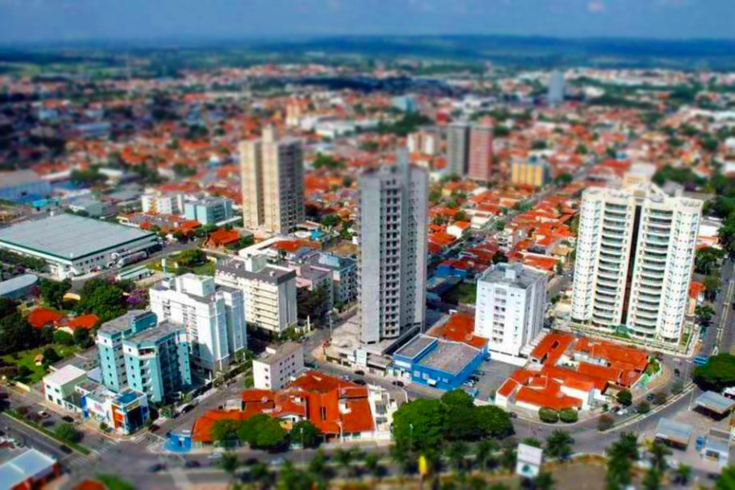

== 2ª Unidade

=== Exercício 1 - filtrohomo.cpp

Implementação do filtro homomórfico para melhorar imagens com iluminação irregular. 

[sidebar]
****
[source,c++]
----
include::homo.cpp[]
----
****

Os resultados são mostrados abaixo:

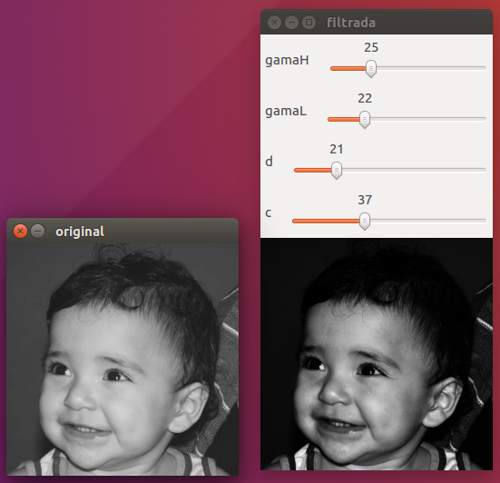

=== Exercício 2 - cannypoints.cpp

Usar as bordas produzidas pelo algoritmo de Canny para melhorar a qualidade da imagem pontilhista gerada.

[sidebar]
****
[source,c++]
----
include::cannypoints.cpp[]
----
****

Figura base:

image:seul.jpg[]

Os resultados são mostrados abaixo:

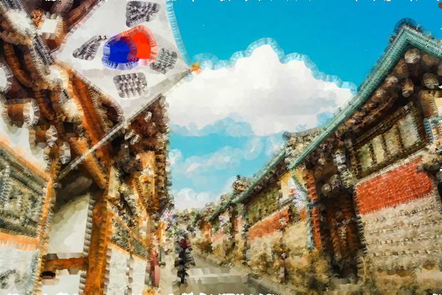

=== Exercício 3 - kmeans.cpp

Realize 10 rodadas diferentes do algoritmo e compare as imagens produzidas. Explique porque elas podem diferir tanto.

[sidebar]
****
[source,c++]
----
include::kmeans.cpp[]
----
****

Figura base:

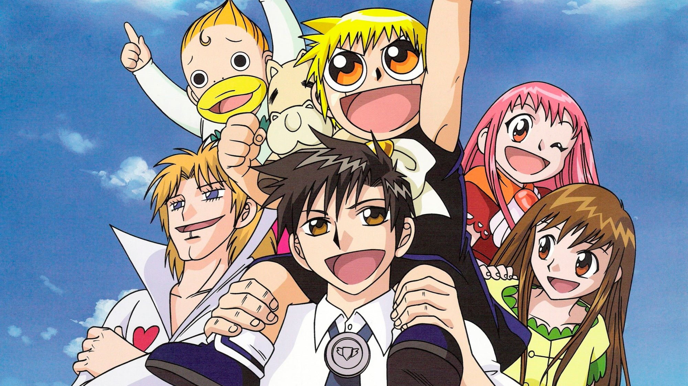

Os resultados são mostrados no gif abaixo:

image:gash.gif[]

Conclusão: Os centros escolhidos pelo algoritmo definem quais cores terão maior peso na reciação da imagem, dessa forma os resultados terão um conjunto reduzido de cores. Como os centros são gerados de maneira randômica o resultado será diferente para cada imagem recriada. 
